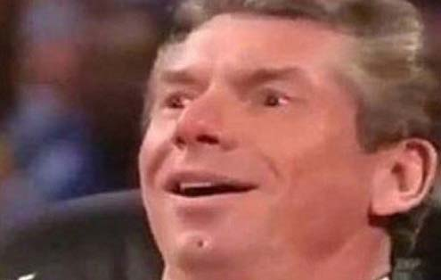

<!-- @import "help.less" -->
# Overview
_Max Sick Gains_ is a mod that changes Bodyslide presets on your PC depending on fitness level. Your fitness level changes by training and sleeping.

_Max Sick Gains.exe_ was made to configure everything related to those fitness levels and how they are applied to the PC (and NPCs if you so desire).

## READ THIS BEFORE ANYTHING
Before you even download this mod, I want to make some things perfectly clear.

### This mod's purpose
***Make people have bodies that match their professions***.

This isn't a _"variety of bodies for the sake of variety"_ type of mod, so I won't be adding options to apply a variety of skins on NPCs or having unique skins on the player[^PlayerExclusiveShapes], **EVER**. [It's just too much work][tech-muscleDef] and ==it's quite prone to introduce hard to track bugs==.

[^PlayerExclusiveShapes]: But this mod offers the means for your player to have their own body shape not shared by anyone, if you want to.

[tech-muscleDef]: https://github.com/CarlosLeyvaAyala/Max-Sick-Gains/blob/master/technical%20docs/muscle-definition.md

Randomizing body shapes on NPCs is possible with the tools this mod already provides. No need to add specific options to make boobs bigger on some NPCs, or something.
==Read this== if you are interested in doing that.

### This mod ***CAN'T*** be just plug and play
Never will. Sorry.

If you want to use it, you should be well acquainted with Bodyslide, SEEdit and mod installing paths.

None of those things are actually hard to learn and I tried my best to be as simple and straight-forward as possible so people with few modding experience can enjoy this mod[^HardSibblings], but teaching simple basic things like *"How do I build a zeroed bodyslide with morphs?"* is not the scope of this mod.
[^HardSibblings]: After all, there's a reason mods that use the same mechanics as this are so hard to configure and understand at first sight.
I tried my best to make the process as simple as possible by releasing the actual tools I use to make my own mod work.
I'm lazy, so I let my tools do most of the job.

<figure>

<figcaption>It's done like this, by the way.</figcaption>
</figure>

... speaking of which...

### This mod requires zeroed bodyslide files for all your armors and naked bodies.
And that's because it uses a somewhat obscure functionality of NiOverride that can apply Bodyslide morphs at play time.
That's the heart of this mod. No other way around this fact.

If you know the basics about Bodyslide you can guess what means to have zeroed sliders: ***All NPCs will look emanciated as fuck***.
To prevent this, this mod has a rich functionality to apply Bodyslide morphs to NPCs based on their races and classes.

If you don't like my way of doing things, you can try to use the [BodyGen options already integrated with RaceMenu][BodyGenReddit] along with this mod, but since I don't do that, I can't guide you or give you advice through the process.
...although I would **personally** do something like `All|Female=Preset` and everything else be damned.
==¿Tal vez sí haga un parche nomás para experimentar?==

[BodyGenReddit]: https://www.reddit.com/r/skyrimmods/comments/gdwdvj/racemenu_bodygen/

## Why this mod?
Why would I do this if there are so many options that already kind of do the same?

Well, for starters, I was getting tired of seeing fucking mages and merchants being as hot and athletic as Lydia.

<figure>

<figcaption>Quit bitching, Lydia. We both know you got those abs by carrying my burdens.</figcaption>
</figure>

My hopes went up when I learned about [zEBD](https://www.nexusmods.com/skyrimspecialedition/mods/36019), but it's quite complicated and the help files never told how to apply its settings to the PC, so I didn't even try.

I tried BOSSE, but my game just gets an infinite loading screen when installed.

[jBS2BG](https://www.nexusmods.com/skyrim/mods/88707) worked all right for NPCs, but for some reason, RaceMenu [BodyGen][BodyGenReddit] didn't apply well[^jBS2BGRox] the Bodyslide preset to my PC and she looked flabby instead of thight and hot.
Ironically, it correctly applied morphs to all NPCs.
[^jBS2BGRox]: I'm totally sure it wasn't jBS2BG's fault, since it correctly exported all Bodyslide data.

So I tried to see if it was a problem with BodyGen or jBS2BG and made a quick dirty Papyrus script to explicitly apply all morphs.
... and it turned out NiOverride actually applied correctly all Bodyslide morphs if I did so one by one.

<figure>

</figure>

Then I suddenly realized I could programmatically make my PC change its shape as if gaining weight by training.
Something you can bet your ass BodyGen doesn't do by it's own.

<figure>

</figure>

Then I thought:
> Why should I stop there?
> If I can control at will what values are applied to which sliders, what's stopping me from using many different Bodyslide presets to represent different stages at my PC's fitness journey, like going from fat to thin and then athletic?
>
>Hell, I could even blend body shapes between transitions so they naturally go from one to other, and since I'm not constrained by weight anymore, I could add as many as I want and I can stay at those fitness levels as many days as I like![^NoGainsPainsMe]

[^NoGainsPainsMe]: You see, I have this problem with Skyrim, where I get bored when my PC gets to the zenit of her (it's always a her, obviously) physical development, so I start a new character just to see her getting progressively hot once again.

<figure>

<figcaption>... that's how legends are born.</figcaption>
</figure>

### Why a homebrew app but not an MCM?
As a player, I love to use MCM.
It was a great achievement and mods that use spells and message boxes to configure things instead of MCM are annoying and so 2012.

But I **hate** programming MCM menus.

No gripes against it. It's solid and as easy to work with as it could be.
... and that's the problem. It won't get any better to program for.

You see, the Papyrus programming language and API (what you use to program for Skyrim) are great at what they were designed for: doing menial tasks. Like...
* Insta-killing NPCs with spells applied to one particular weapon.
* Changing NPC AI packages.
* Placing NPCs.
* ~~Working on big arrays of data~~... oh, sorry. It can't.

But if you want to add actual custom functionality that devs never dreamt of, you are out of luck.
It's no coincidence most awesowe mods require SKSE (which extends the Papyrus API Bethesda gave us) or use dlls to do things that were programmed in real programming languages; things that are simply not possible with Papyrus.

If I had to do anyway an external program to allow players setup my mod, then I can go the extra mile and do all GUI and configuration stuff at there, since I'd rather use a real programming language instead of Papyrus.

## What's a "fitness level"
Imagine you want your PC to go on a body transformation journey. She (I'll assume your PC is a "she" because that's the most probable thing anyway) will have many fitness levels along that journey:

* Obese
* Flabby
* Plain looking
* Fit
* Athlete

Traditionally, you would make a `Bodyslide Preset` that went from obese to athletic, use a mod that dynamically changed your weight, like `Pumping Iron` or my own `Sandow Plus Plus`[^NoRemorse] and let them work their magic.

<figure>

</figure>

That would work quite fine for the extreme levels of your `Bodyslide Preset`, ie. while your weight was around 0 and around 100, but intermediate levels would look like a weird mix or fat and fit (and you could never be thin[^FatToFit]).
[^FatToFit]: IRL, most people who go from fat to fit usually go from fat to thin and then from thin to athletic. It's a bit unusual to see someone go directly from fat to fit.

<figure>

<figcaption>In <a href="https://youtu.be/NPNs8aYlimM">Taco</a> this is also known to us as Mamado-Gordo.</figcaption>
</figure>

Not anymore.
With Max Sick Gains you can assign a completely different Bodyslide Preset for each one of those fitness levels.

For example, you could create many different _Fitness Stages_, assign some Bodyslide Preset to each one of them, and them tell this program that you want to use them on your PC.
Something like:

|Fitness Level |Associated Bodyslide Preset|
|--------------|---------------------------|
|Obese         | [Full body]               |
|Flabby        | CBBE Chubby               |
|Plain looking | CBBE Curvy                |
|Fit           | DM Athletic[^NoRemorse]   |
|Athlete       | DM Amazons[^NoRemorse]    |

[Full body]: https://www.nexusmods.com/skyrimspecialedition/mods/53402

[^NoRemorse]: Yeah... expect to see many shameless plugs of things I've done in the past. I didn't do them for nothing.

==See here== to learn how to configure them.

# How to change fitness stages
The idea is mostly the same of Pumping Iron and Sandow Plus Plus:
* ==Train==
* Sleep
* See your gains reflected on your body

If you train and sleep well, you will advance to the next fitness level. If you don't, you can regress.

## Training
You train by:
* Gaining one point in ==skills that contribute to your fitness journey== (One Handed, Block, etc).
* Having sex[^LL].
* Use ==training sacks== bundled in this mod.

[^LL]: This mod is a Lover's Lab exclusive, after all.

Anytime you do one of those you will get `Training`, which is a variable that goes from `0.0` to `12.0`[^LimitTraining]. Each time you sleep, some of that `Training` gets converted to `Gains` (pretty much like PI and SPP).
*[PI]: Pumping Iron
*[SPP]: Sandow Plus Plus
[^LimitTraining]: You can't go above 12 because too much training won't get you hotter faster... just like real life.

Not all type of training is the same. Doing hard physical activity will contribute quite a lot to make you fit, while mild physical activity (like having sex[^SexIsNotHard]) won't.
[^SexIsNotHard]: You would reaaaaally be in quite a bad shape if sex is extenuating to you.
... and no one han gotten a nice athletic body by having lots of sex, anyway.

|Activity type                |Contribution to training    |
|-----------------------------|----------------------------|
|Physical skills[^PhysSkills] | High                       |
|Magic skills[^MagicSkills]   | Low                        |
|Training sacks               | Very high[^OnTrainingSacks]|
|Sex                          | Very low                   |

[^PhysSkills]: One Handed, Two Handed, Archery, Block, Smithing, Sneak, Heavy Armor, Light Armor.

[^MagicSkills]: Alteration, Conjuration, Destruction, Illusion, Restoration.

[^OnTrainingSacks]: Read ==this== if you want to know the logic behind this.

### Training decay
To encourage you to go and play the game, this variable has a little bit of decay each day. You will lose `0.3` `Training` a day.
This was made just to make you get your ass off the couch.

You will notice this is quite different to PI.
There you would lose 10% of your current training a day, which is actually quite gargantuan. The more accumulated training you had, the more training you would lose.

What's the 10% of `100` and what's the 10% of `1`? Now compare those numbers with a fixed number of `0.3`.
I rest my case.

Since here your `Training` can never go above `12.0`, I assumed a fixed value of `0.3` loss a day is rather fair.

### Inactivity
If you don't train for a while, you will be considered to be inactive and will start to regress in _Fitness Stages_.
You will lose `0.5` a day of your `Training` (that's on top of your normal `0.3` decay) and `80%` of what you would have added to `Gains` per day of being fully inactive.
See ==math page== if you want more details.

Unlike SPP, inactivity here isn't a *do or do not* thing. That is, your inactivity counter won't get automatically reset to `0` once you have any kind of physical activity.
*[PI]: Pumping Iron
*[SPP]: Sandow Plus Plus

Just like ==training==, different types of activity will have different type of contribution to consider you physically active.

| Activity type                | Contribution to being active |
|------------------------------|------------------------------|
| Physical skills[^PhysSkills] | High                         |
| Magic skills[^MagicSkills]   | Low                          |
| Training sacks               | Very high[^OnTrainingSacks]  |
| Sex                          | High                         |

[^PhysSkills]: One Handed, Two Handed, Archery, Block, Smithing, Sneak, Heavy Armor, Light Armor.

[^MagicSkills]: Alteration, Conjuration, Destruction, Illusion, Restoration.

[^OnTrainingSacks]: Read ==this== if you want to know the logic behind this.

As you can see, having sex will contribute a great deal to consider you active, but ==will not count too much towards training==.
This means you will maintain your current shape by having sex, but don't expect to get significantly hotter by being a horny fuckhead.

## Sleeping
Each time you sleep, some part of your `Training` gets converted to `Gains`.
The more you sleep (up to a point), the more `Gains` you get.

Sleeping 10 or more hours in a row will convert `1.0` of your `Training` to `1 day` of `Gains`.
Sleeping 9 hours would net `90% of a day` for `0.9` `Training`, and so on...

Once you have slept, you won't be able to make `Gains` from sleeping again for the next `3` hours.

There are no limits to how many times a day you can sleep to make gains, but you certainly wouldn't want to do that, since sleeping time totally counts as ==inactivity time==.

## Gaining
You train, sleep and then gain.
The more you gain, the better you look.

`Gains` is a variable that usually goes from `0%` to `100%` and it's related to your ==current `Fitness Level`==.

When you ==sleep==, some of your `Training` gets added to this variable. **Once you get to `100%` or more you advance to the next `Fitness Level`**.
Be too inactive and once you reach negative numbers you will go back to the previous `Fitness Level`.

*[PI]: Pumping Iron
*[SPP]: Sandow Plus Plus
*[PC]: Player Character
*[CTD]: Crash To Desktop

# In depth math
Don't fret. Math in this mod is quite simple, but may require more explanation if you really want to know how much rewarded/punised you will be.

Gains and losses are controlled by ==how many days you defined your current Fitness Stage== to last under ideal conditions. We will call that number `maxDays`.

## Calculating `Gains`

Gains is a percentage that usually goes from `0%` to `100%`.
As you may know, `100%` is in fact a plain `1`, while `50%` is `0.5`, and so on. This means `Gains` is usually a number between `0` and `1`.

How do you calculate `Gains` with this knowledge? Simple.
We know each time we sleep we can gain at maximum:

$$maxGainsPerDay=\frac{100\%}{maxDays}$$

Which is the same as
$$maxGainsPerDay=\frac{1}{maxDays}$$

And those `maxGainsPerDay` depend on how much you sleep.
If you sleep 10 hours[^hoursSleptCap] you would get `100%`, so this is the formula for that:

$$sleepingGains=\frac{hoursSlept}{10}$$

The final formula to calculating `Gains` is this:
$$Gains = sleepingGains \cdot maxGainsPerDay$$

As expected, `Gains` is a percentage of hours slept and what you can gain at max per day.

### Examples
If you are at a `Fitness Level` you defined as having a 10 days duration, you would get these `Gains`:

$$ Gains=\frac{10}{10} \cdot \frac{1}{10} = 0.1$$

Or `10%` of what you need to reach next `Fitness Level`.

Another example: 9 hours slept on 120 days duration.
$$ Gains=\frac{9}{10} \cdot \frac{1}{120} = 0.0075$$

... and `0.75%` was gained on that day.

## Losses
When inactive, you will lose `80%` of `maxGainsPerDay` for each day being inactive.

### Examples
|`maxDays`|Losses per day|
--|--
10 | $ loss= 0.8 \cdot \frac{1}{10} = 0.08 $
120 | $ loss= 0.8 \cdot \frac{1}{120} = 0.006\bar{6} $
56 | $ loss= 0.8 \cdot \frac{1}{56} = 0.01428 $

So, if you spend 7 days arrested for a serious crime (worst inactivity scenario I know of), you would get:

|`maxDays`|Losses per day|Actual days of gains lost| Percent to next level lost
--|--|--|---
10 | $ totalLoss= 7 \cdot 0.08 = 0.56$ | 5.6 | 56%
120 | $ totalLoss= 7 \cdot 0.006\bar{6} = 0.46662 $ | 5.59 | 4.66%
56 | $ totalLoss= 7 \cdot 0.01428 = 0.09996 $ | 5.59 | 10%

As you can see, you lost the same days of training for all scenarios, but the longer the `Fitness Level`, the leser the punishment. What's 5.6 days compared to 120 anyway?

But while this would be a lot more catastrofic for shorter levels, it still doesn't matter that much, because you can get back on your feet as fast as your losses.

### The take on
Punishments are not as hard as it would seem and that's on purpose.
It's annoying to be obsessed with not losing your gains. I'm not like that even in real life, why should I panic about that in a game I play for fun?

[^hoursSleptCap]: `hoursSlept` is actually capped at 10, but I want to maintain these formulas simple so we don't lose the great picture.
