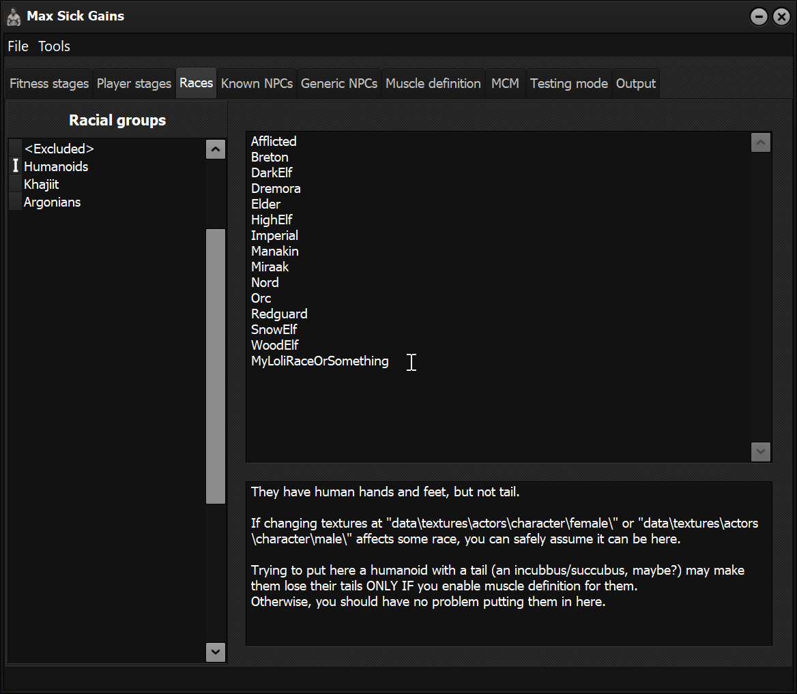

<!-- @import "help.less" -->
# FAQ

## I don't understand how to make this mod to work

lol good luck git gud :v

Ok, no...
If you don't manage to make this work after following all ==tutorials== and/or [setting off all muscle definition options][MCMTab], then this mod is too advanced for you[^Condescending].

[^Condescending]: I'm not trying to be a condescending asshole, trust me. This mod just can't be plug and play and it requires some modding knowledge on your part.

Play any other mod. I can't do this easier to work with.

<figure>

<figcaption>Here; take these kittens. They are proof I'm not an angry asswipe.</figcaption>
</figure>

## This mod starts too late. It ruins muh immersion \>:'v

<figure>

</figure>

You are too old to be throwing around temper tantrums like that.
Get off my lawn, you fucking millenial!

<figure>

<figcaption>Heh... you just wait to see all my sexist jokes.</figcaption>
</figure>

Ok...
If you are a normal person that can be rea  soned with[^YouAreBreathtaking], I need to tell you there's a reason for that.

I deliberately added a 60 seconds delay when starting this mod, so it gives Skyrim some breathing room when you are starting a new game.
This means it will pass a whole minute before you see changes made by this mod.

I wish more mod authors add some delay to their non-essential mod initialization.
In my opinion, it's more "immersion" breaking to have malfunctioning MCMs and things like that because Skyrim tried to setup too many things at once.

[^YouAreBreathtaking]: Of course you are! You have tolerated all my jokes so far :v

## Will you port this to LE?

No. I don't have LE and don't see the point of going back to the 32 bits era.

<figure>

<figcaption>Yeah... you may have better ENB, <strong>but can your game allocate more than 4GB memory?</strong> Ha ha! I thought so.</figcaption>
</figure>

However, if you want to try to backport it, be my guest.
I don't know how much help I can provide you on the conversion process, but don't be afraid to ask me anything about this mod.

## Is this mod lightweight?

It uses scripts.
You tell me.

<figure>
<!-- <video width="500" height="213" src="img/worst-acting.mp4" preload="none" autoplay="autoplay" loop="loop">
  Dude... if you can't watch this is because you are still using Internet Explorer... after 1998!
  </video> -->

<figcaption>Heh...you just pissed on your pants.</figcaption>
</figure>

Well, I better tell YOU.

If you are afraid it will make your game to CTD because of scripting overhead or something, I don't think that would be an issue in a normal playthrough.

This mod is dormant most of the time and only acts when loading a new cell, which is a thing that only happens when you enter a new location or when a location is so large it is composed of many cells.

When a new cell is loaded, this mod will process ***ALL*** NPCs in them.
If there are ***too many*** NPCs in there and you have ***too many*** things running at once, then your game could actually CTD.
But I guess you were already on the verge of CTD anyway; thanks to scripts that actually work by doing intensive calculations during polling[^Polling].

[^Polling]: This means, they blindly and inefficiently run every certain number of frames, wether they should or not.

Those are the kind of scripts that give a bad reputation to all scripts and are always made by amateurs.

<figure>

<figcaption>Hey, I didn't take an actual programming career and learned to hate everything related to <strong>The Klingon of Programming Languages</strong> just for nothing (by the way, feel free to send your hate mail over my little joke to my <a href="mailto:I_Dont_Care@Only-people-with-yellowish-underpants-fight-over-programming-languages.not.me">I don't give a shit</a> email).</figcaption>
</figure>

You are totally not wondering about this, but one of the many reasons I'm using JContainers and the Lua programming language to make this mod is because Lua is lightning fast, and in my (admittely, meager) testings it runs way many times faster than the equivalent code made in Papyrus.

Still, I've noticed new locations take about 1 second more to load than they used to take[^BeforeOptimizations], but you play games made by Bethesda, so you already got used to wait long times in-between loading screens.

[^BeforeOptimizations]: This line was written before optimizations. Most of the time you shouldn't notice this mod is working.

## Will this mod bloat my SKSE co-save?

Totally.

Using [NetImmerse Override Cleaner SE][] perodically is a must for a modded Skyrim anyway, but now you need to use it after each 50 hours of gameplay or so, instead of the usual 70.

You will know it's time to use it when save times become unusually long.

## Will Charmers of the Reach...?

Stop right there. I don't want to deal with that mod.

Nothing wrong about it, but its implementation it's higly incompatible with some implementations from this mod.

## Does this work with _\<insert some race here\>_?

Bodyslide preset applying will work on any NPC that uses a body that supports Bodyslide morphs.
Just add your race name to the most appropiate _Racial Group_ (most likely, _Humanoids_), so this mod recognizes them.

<figure>

</figure>

**Muscle definition however, is an entirely different matter.**
It's no coincidence there are so many options to control who won't change muscle definition.

I won't get here into technical details on why this is so complicated, because that requires a whole [technical document][tech-muscleDef], but an easy way to know if your race is allowed to change muscle definition is to just try it.

To enable muscle definition for custom races...

* For players: check _Apply muscle definition_ in the [MCM tab][MCMTab].

* For NPCs: do as above and try to [add some Known NPCs][KnownNPCAdding] if your mod introduces new NPCs of that race.

At this point, many things could happen:

* **Your race looks damn fine**.
Congratulations. Go play the game and get hot by training.
&nbsp;

* **It looks right, but lacks some feature, like a succubus tail**.
Share your mod with me and ***maybe*** I can make a patch to make it work.
&nbsp;

* **There's a minor texture mismatch between hands/head and body** (mostly, coloring).
This is a complicated matter with no standard solution. It all depends on how the mod was made.
First try using [this][Fix tex mismatches]. If that doesn't work, ***I can try to see if a patch is viable when I feel like doing so***[^NotMyJob] and there's no warranty it can be done.
For example, _Charmers of the Reach_ seems to be a real pain in the ass when it comes to these kind of matters.

[^NotMyJob]: I don't want to sound rude, but I hope you understand tailoring this mod to every single user is not my job... and damn, I want to play this game too! Not spending the rest of my life working on this mod.

* **There's a major texture mismatch between hands/head and body**.
You are most likely using furries, yes? Then yiff in hell.
OK, that's not an answer (but a valid suggestion, nonetheless :v). The real answer is: ***I won't be doing a patch for that***. It would mean a major redesign of this mod and _Max Sick Gains.exe_; [it's just too much work][tech-muscleDef].

## Muscle definition is too complicated

Yeah. It's the most complex feature to get properly running... by far.

Don't waste your time getting marveled at the complex and arcane mysteries it entails.
If you don't understand it or just want to play the damn game without spending many frustrating hours trying to setup some obscure mod made by some random asshole, just uncheck all muscle definition options at the [MCM][MCMTab] and enjoy the game.

## How do I add _Known NPCs_ from non vanilla mods?

[Follow this procedure][KnownNPCAdding].

## Characters don't look as expected

Some possible issues:

1. If using muscle definition, you forgot to generate all normal maps needed[^EvenMe].

1. Make sure you didn't actually put a male bodyslide preset in the female field inside the [Fitness stages tab][McmFitnessStages][^EvenMe2].

1. Some armor sliders are simply badly done.
Before you blame my mod[^EvenMe3], make sure to look at your characters while naked ( ͡° ͜ʖ ͡°) (them, **NOT you**).

1. HIMBO 4.x has some sliders that seem to have a default value of 100 (like the forearm size, for example), so when you set a value to 100, it doesn't get saved to the xml file and _Max Sick Gains.exe_ can't export that slider value because it doesn't actually exist inside the file.\
Try setting all those values to 99, instead. That should solve your problem.

1. If the problem is a _Known NPC_, remember some NPCs have many different versions (ie. Rikke, Cicero...), so you need to add all versions of them to _Known NPCs_.

1. You may got unlucky and Skyrim refused to find all data needed to change an NPC appearance.
This is more of an annoyance than a serious problem. Use the [hotkey for solving that][McmHotkeys].

1. You may be using an *.xml file that contains many Bodyslide presets. **This mod only supports one preset per file**.

[^EvenMe]: That happened even to me! While this mod was at its first playable stage, humanoid men looked quite bad.
I knew the scripts were bug free, so I triple checked the esp records instead and everything was fine.
When I opened the CK to make sure all texture paths were correctly setup, turned out I forgot to generate normal maps for humanoid men.

[^EvenMe2]: Yep. I did that, too \>_\>

[^EvenMe3]: Do you really want to know how many problems not caused by my mod I thought were caused by it while I was creating it?
This one was related to the vanilla armor conversions of HIMBO 4.2.
My mod was supposing to work as expected, but characters didn't look the part, so I stripped naked some random guard and turned out my mod was actually working as expected; the ones that didn't work quite well were the armors all along.

### How do I know if I have that last problem?

Open your *.xml preset file in Notepad or whatever.
<figure>

<figcaption>This is how an*.xml file looks like in Notepad++.</figcaption>
</figure>

This file is `CalienteTools\BodySlide\SliderPresets\CBBE.xml` (the default presets for CBBE) and each one of those marked lines is an individual preset.
This is exactly the kind of file this mod doesn't support.

Let' say, we want to extract _CBBE Curvy_ from here.

Just open Bodyslide, select _CBBE Curvy_ and click on _Save As..._

<figure>

</figure>

Once saved your new file, use that in your ==_Fitness Stage_== instead of _CBBE.xml_.
That's all.

## Your mod doesn't apply changes to some NPCs

I'm quite aware about that, but ***there's nothing I can do about it***.

I use _PapyrusUtil_ for getting all NPCs inside the cell the player is located, and for some unknown reason, it seems it sometimes finds an NPC but gets invalidated data for it.
Hell... I don't even know if that is a _PapyrusUtil_ or a Skyrim issue.

_PapyrusUtil_ sometimes works again the first time you close and open the game, it sometimes may take many tries for it to work... but don't worry; **that's precisely why I added a hotkey for forcing an NPC to get updated**.

## All my problems are related to men

Of course they are!

<figure>

<figcaption>We aren't the root of all evil for nothing!</figcaption>
</figure>

Men bodies are severily lacking behing compared to women's, so they are relatively more untested and unstable.

In 2010 there were some options to change male vanilla bodies, but in 2020 in Skyrim SE, there aren't as much options as there were in the past.

There have been made some advancements in recent years, but they haven't been as widely adopted and used as CBBE or UNP (and let us be honest: they will never be).

<figure>

<figcaption>In any single game I have the option to choose my sex, I always go for a woman because if I'm going to stare at an ass for the next 1000+ hours, at least I want it to be a beautiful and shapely one... and you can bet I'm not the only one that thinks that way.</figcaption>
</figure>

Fortunately, things seem to be changing with the arrival of HIMBO (specially V4.2, which is compatible with everything SOS related) and I've seen more people making armors specifically made for men.

Once knowledge about how to work with HIMBO gets widely gathered and spread, expect to have men bodies that _It just works_&trade; the same way women bodies just work along with this mod without too much hassle.
My mod doesn't make much distinction between men and women whatsoever, so expect it to be ready for battle when that fabled time finally comes.

## I got textures mismatches on some NPCs

Let me guess: this happens to followers from some mods you downloaded, am I right? And I could bet my life savings they all are women.

<figure>

<figcaption>Women... it's always wo... hey, why are so many people coming at me with pitchforks??? :'v</figcaption>
</figure>

Disable this mod and check again if this happened before you installed it.
If the texture mismatch still happens, congratulations! You are using a mod that forces you to use the texture sets the mod author shoved down your throat, you lucky bastard!
[Use this script][Fix tex mismatches] to fix that bullshit.

This is a list[^TexBullshit] of mods that I know to cause those issues (and fixed with the script above):

* All Bijin mods
* The Ordinary Women
* Vilja
* Sofia the funny voiced follower (or something)

[^TexBullshit]: This is an ever growing list, by the way.
If you find some other mod that does that kind of evil thing, please report it back to me so I can add it here.

By the way, don't blame me if you swear this didn't happen before installing my mod but now it does. **This mod uses your own installed textures** precisely to avoid that.
Maybe you never noticed that issue until now, that my mod made that problem painfully obvious[^OrdinaryWomenTextures].

If my mod is actually causing those issues, add the terrible looking NPCs to _Known NPCs_ and disable muscle definition for them.

## I don't have fat textures for Khajiit or Argonians

Yeah, me neither.
That's why I generated the fat textures from the same textures I use for the plain looking bodies.

<figure>

<figcaption>Yeah... fat beastmen have the same muscle definition as their plain counterparts.</figcaption>
</figure>

That's better than nothing.

## Why are Astrid and Afflicted banned by default from getting muscle definition?

This ban affects only the burned version of Astrid[^AstridSpoiler], who of course has no business being ripped/fat/whatever.

Afflicted are banned because they get the same kind texture mismatch problems you would get on... say, furries.
And getting them to work would mean [doing the same amount of work I refuse to do][tech-muscleDef] for other races people actually care about.

## Will you add skin variety to this mod?

**HELL, NO!**

Not that this thought never crossed my mind, but it turned out it's just too much work to get it done.

Remember the [pizza hands problem][tech-muscleDef] with NiOverride?

<figure>

<figcaption>Well, it also affects diffuse maps; so using NiOverride to add skin variation is out of the question.</figcaption>
</figure>

That limitation would make me add even more records to _Max Sick Gains.esp_, thus making it not an esl file, breaking saved games, making baby Jesus cry, filling your game with scripts that will make your house explode and ultimately causing World War V to erupt.
Well, some of those things may not happen, but why risk the chances?

Also remember this: having a human (like me[^ZuckerBot]) filling an esp file with many thousands of records has an great inherent risk of introducing hard to track bugs.
It's no coincidence Skyrim is so bugged and needs so many unofficial patches to get it to somewhat properly work.

I used a script to count all records related to appearance[^NoManualCount] and they were 216 just for one kind of skin and only for vanilla races.
Since most of editing when adding new textures and such has to be manually done, you can understand why I'm not doing that.

[^NoManualCount]: Because you can bet your ass I wouldn't count those one by one myself.

[^ZuckerBot]: What the hell? Only androids like [The Zuckerbot] need to reassure they are human.

## This mod broke my _\<other mod\>_ that relies on actors weight

tl;dr: **It wasn't this mod per se, but zeroing your Bodylide armors for making it work**.

Unlike weight gaining mods like PI or SPP, weight is mostly not used, since it's irrelevant for almost anything this mod does.

In Max Sick Gains, **weight is only used to change NPC muscle definition** if you used this (and only this) option:

<figure>

<figcaption>Known NPCs tab</figcaption>
</figure>

And it will be used as a reference.
***This mod doesn't manipulate weight at all***.

Still, due to it requiring having zeroed Bodyslide presets, it is posible to have incompatibilities with mods that rely on weight to change player appearance.

These incompatibilities shouldn't be of the CTD kind (hopefully), so don't worry. It's just that, even if those mods are making their calculations correctly, you may not see them reflected on the shape of your body due to your zeroed armors.

I suppose mods like ==Hormones== or ==Lazy Body Edit==, that seem to work on bones instead of bodies, may work without a problem.

*[PI]: Pumping Iron
*[SPP]: Sandow Plus Plus
*[PC]: Player Character
*[CTD]: Crash To Desktop

[^AstridSpoiler]: That was an spoiler for a 10+ years old game that was launched even for your toaster an it somehow just works, motherfucker.

[^OrdinaryWomenTextures]:A few years ago I suddenly noticed horrible coloring mismatches in the hands and heads of women modified by Bijin and The Ordinary Women. I swore it was some other mod I recently installed but it turned out to be that both those mods were the culprits all along.
But I never noticed that before, even after many years using both of them!

[Fix tex mismatches]: https://www.loverslab.com/files/file/18289-fix-texture-mismatches-lesewhatever/

[KnownNPCAdding]: TO-DO

[McmFitnessStages]: TO-DO

[McmHotkeys]: TO-DO

[MCMTab]: TO-DO

[tech-muscleDef]: https://github.com/CarlosLeyvaAyala/Max-Sick-Gains/blob/master/technical%20docs/muscle-definition.md

[The Zuckerbot]: https://youtu.be/2qGVVxaosDM

[NetImmerse Override Cleaner SE]: https://www.loverslab.com/files/file/13709-netimmerse-override-cleaner-se-skse64-co-save-cleaner-utility/
