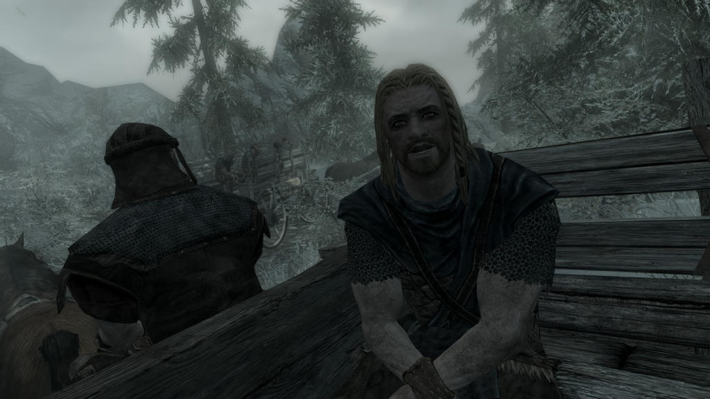

<!-- @import "help.less" -->

# MCM

## Auto save config

Quick. Tell me what's the most boring thing you have to deal with every single time you start a new sneaky archer?

<figure>

<figcaption>No! I'm not talking about this!</figcaption>
</figure>

Why, setting up your mods in the MCM of course!

I designed this mod to hopefully be _"use the MCM once, never come back again"_, so it has an auto saving and loading configuration that is persistent across saves.

Why wasting your time configuring my mod, when you can waste it configuring all the other ones?
