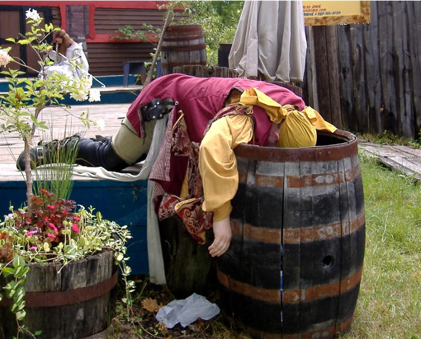
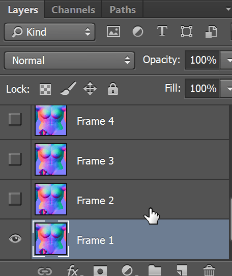
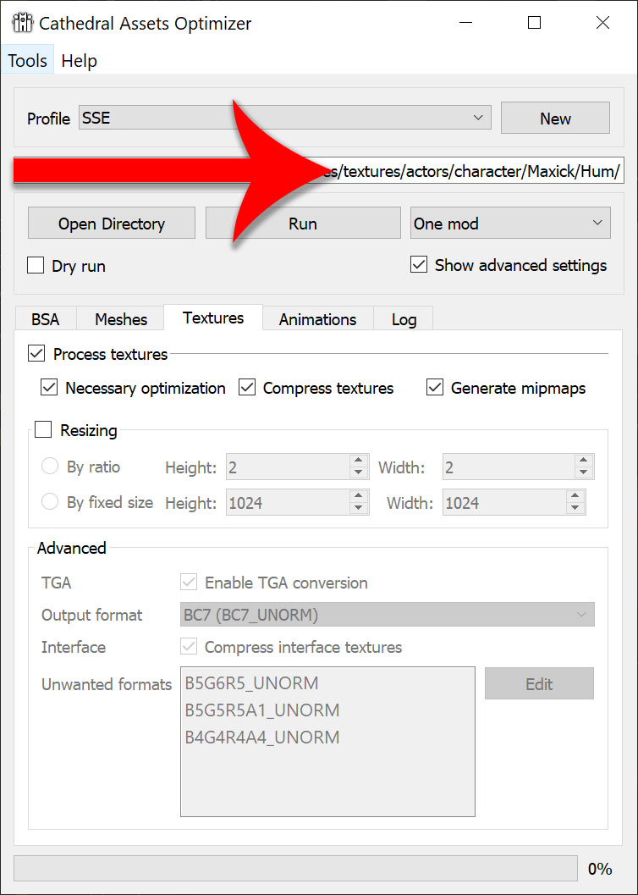

<!-- @import "help.less" -->
# Creating your own muscle definition textures
***WARNING: just give this tutoral a quick check before doing anything. If you think this is too much work[^NotThatMuchWork], I suggest you not to use at all the muscle definition changing capabilities this mod offers.***
[^NotThatMuchWork]: It's not that much work once you have good textures. Exporting **ALL** needed textures for all races shouldn't take more than 15 minutes.

Last time I did the mistake of doing something for [making people ripped](https://www.nexusmods.com/skyrimspecialedition/mods/34632), I released textures made by me and it's quite annoying to give them maintainance, to be honest.

People were asking me to do textures for their favorite packs all the time and I'll tell you the truth: most of the time I don't feel like doing them. It's just too much work trying to make them blend[^NotThatMuchWork].

Since this mod requires you to use your brains to set it up anyway, I figured you wouldn't have a problem doing your own texture sets using my own automated tools that make this process as pain free as possible.
Remember **machines exist so they work instead of us**.

By the way, one of them only works if you use Photoshop.

<figure>

<figcaption>Jar jar jar... who am I kidding <i>"if"</i>...</figcaption>
</figure>

You will notice I'm not using the NVIDIA plugin to save `dds` files.
It's ok if you want to use it. I just prefer to use more automated methods because I honestly can't be arsed to learn all kinds of micromanaged texture optimizations for `dds` files.

## Overview
1. Get two normal maps. Those will be your (lack of) muscle definition extremes.
1. Open them in [Paint.net](https://www.getpaint.net/) and save them as `tga`.
1. Add those two tga `files` to a new Photoshop file as separate layers.
1. Double click the file named `Skyrim Texture Manipulation.atn`.
That will add an action folder to Photoshop.
1. Run `Create texture transition`.
1. `File > Export > Layers to files...` (names will depend on what kind of muscle definition you are creating).
1. Run [Cathedral Assets Optimizer](https://www.nexusmods.com/skyrimspecialedition/mods/23316) on your new textures.
1. Profit.

## Step by step
### Get normal maps
This may actually be the hardest step of them all.

Fun fact: *did you know&hellip;* compared to most of the Skyrim player base, we may be as well be considered some fetishist weirdos?

<figure>

<figcaption>This is what the average Skyrim player actually finds sexy.</figcaption>
</figure>

Sadly, [normal textures](https://en.wikipedia.org/wiki/Normal_mapping) to make characters look ripped aren't easy to come by.
Granted, it's not the same desolate panorama it was 6 years ago, but it's still a long way from ideal.

Making characters progressively ripped isn't usually a priority to texture pack authors, so it's even harder to find texture sets that blend beautifully.
Most of the time you have to do the hard work yourself, like I did.

Back to the topic.
You may want to get some textures that blend nicely.
I'll show you how they look some that don't.

<figure>

</figure>

Notice how abs **shapes are totally different**.
***Those are the kind of mismatches you should actively search for***.

Let's see how they blend.

<figure>
<video width="500" height="500" src="img/bad-normal-progress.mp4" preload="none" autoplay="autoplay" loop="loop">
  Dude... if you can't watch this is because you are still using Internet Explorer... in 2021!
  </video>
<figcaption>... pretty bad.</figcaption>
</figure>

Did you notice how the upper line of the 8-pack[^8pack] dissapears without a trace and how abs got progressively wider?
Also, look at these double lines:
[^8pack]: Yeah... [that's a thing](https://duckduckgo.com/?q=8+pack&iax=images&ia=images).

<figure>

</figure>

You may think they don't look so bad, but believe me: they look terrible in-game.

### Open your selected textures in [Paint.net](https://www.getpaint.net/)
When you finally manage to find some decent textures, open them in [Paint.net](https://www.getpaint.net/) and save them as `tga`.

Skyrim SE supports a more modern and better compression method for `dds` named `BC7`, so many people are saving their textures using that algorithm.

The problem is, many older programs don't know how to open those files, so it's quite usual to get programs saying they don't recognize the file format.
[Paint.net](https://www.getpaint.net/) is not one of those programs. It can reliably open and save `BC7` files.

You will also work on `tga` files because that's a lossless format, unlike `dds`.
You should never work on, and directly edit `dds` files for [the exact same reason you don't do that with jpg files](https://photo.stackexchange.com/questions/19270/what-are-jpeg-artifacts-and-what-can-be-done-about-them).

<figure>

<figcaption>... unless you want to see how a mod done by a shitposter would look like.</figcaption>
</figure>

### Add those files as separate layers to Photoshop
And ***name them `Layer 1` and `Layer 2`, otherwise my Photoshop Action won't work exactly as expected***.

<figure>

</figure>

`Layer 2` is *"the most"* you want your textures to be; *the most* ripped, *the most* obese...

This is the step where you are most likely to spend the most time.
You will be changing `Layer 2` opacity back and forth to make sure both normal maps blend nicely.
If they don't, expect to spend a couple of hours copying, pasting, masking, testing, cursing... bodyparts so your textures blend nicely.

This doesn't need to be perfect, by the way.
As you are about to learn, you just need to make sure the big bad rough shapes transition correctly.

### Running the Photoshop action
When you double click the bundled `atn` file in this mod[^espDir], a new Action will be added to Photoshop.
You just need to run that.
[^espDir]: It's in the same folder as `Max Sick Gains.esp`.

<figure>

</figure>

If you correctly named your layers as `Layer 1` and `Layer 2`, now you should have 6 layers named `Frame n`, with no `Layer 1` or `2` on sight.

<figure>

</figure>

If you have any other layer that is not named `Frame n`, now it's the right time to delete it.

#### Notes on image size
You will notice my Action automatically resize your textures to 1024&times;1024.
You can undo that last step if you want, but I suggest you to leave your textures at that size for two reasons:

1. They are smaller in size.
1. You wouldn't notice if it was a better resolution, anyway.

You see, unlike diffuse (color) or specular (wetness) maps for bodies, normal maps (shapes) don't have fine details that ought to be preserved for the character to look great.

Having 4k or even 2k normal maps for people skin is a waste of video card memory and hard disk space.
As I said, skin doesn't have the same kind of surface detail a rock has, for example.

Since normal maps on skin are used to represent bigger shapes (like muscle separations, boob curves...), you can get away with going lower than usual.
Hell... I've even tested 512&times;512 and it still looked good, but muscle striations for really riped bodies started to dissapear, so I settled down to 1024 as a good compromise between size/quality.

And let's not forget about file size.
It's not unusual for **one single 4K normal map to weight a whopping 85MB!** (you read that right).
Compare that with a 1K normal map raking a meager 1.33MB, or a 2K going by 5.33MB.

Still not convinced? Remember these textures you are about to save are just 6 out of 108.
Go make your calculations.

### File > Export > Layers to files...
Make sure you are **saving them as `tga`** in the corresponding directory.
Use whatever name you like. We are going to rename those files anyway.

<figure>

</figure>

Once you are done, drag and drop all of them to `TexRename.exe`, which is located in the same folder as `Skyrim Texture Manipulation.atn` and `Max Sick Gains.esp`.

<figure>

<figcaption>These are the only two questions you will ever be asked.</figcaption>
</figure>

Follow instructions and now you should have your files correctly renamed.

### Run [Cathedral](https://www.nexusmods.com/skyrimspecialedition/mods/23316)
Remember all that babbling about `BC7` and whatnot? Cathedral does all that for you.

<figure>

</figure>
