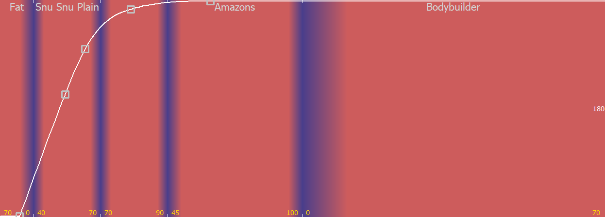
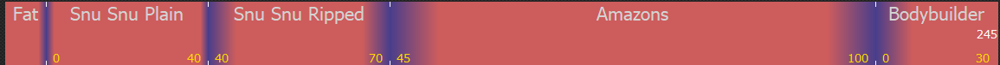
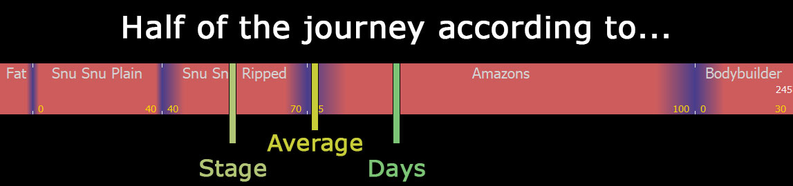

# Getting player total progress

This mod sends three values when gains are calculated:

- Progress percent based on what's the player's current Player Stage.

- Progress percent based on how many days are left to finish the whole fitness journey.

- The average between those values above.

You should take whichever makes more sense according to what you want to do.

Here are their traits.

### Progress based on stage:
- Predictable.
- If player stages vary too much in duration, may lead to inaccurate results.

### Progress based on days:
- Tends to be more accurate.
- May be be mostly useless when some player stages are too long compared to others.

### Average progress:
- Not too good nor bad.
- May be the most consistent most of the time.

## Why the hell should I care?

You can easily make mods that vary things according to your appearance.

I'm just throwing ideas around, but you can make people react to the way you look based on your percentage to your goals.

I made myself an integration addon for [Babo Dialogue][], which automatically varies how beautiful people think you are.

For that addon **I used progress by days** because that was what made sense, since I had direct acces to the visual representation of the journey by days:

# An example

Here's a sample _Player Journey_:

We see most of the time is spent in the _"Amazons"_ stage, but what do our values say about it?

You can go back and forth to the table down below to see the values I'm going to talk about, but a visual representation is better.

There are 5 stages, so progress based on stages (`Progress by stage %`) will tell us the half of the journey is stage 3.5; that is, at the middle of _Snu Snu Ripped_. \
... which is obviously wrong.

On the other side, day based progress (`Progress by days %`) tell us half the journey is at the exact middle point of the chart[^DaysMiddle]: somewhere around the 25% of the _Amazons_ stage, at around 25 points in gains in that stage (number 4).\
That's indeed more visually and matemathicaly accurate.

[^DaysMiddle]: This is true for any player journey, in fact.

What does the average tells us? \
It says the middle of the journey is roughly starting the _Amazons_ stage. \
That may not be nor mathemathically nor stage-wise accurate, but seems to be more "conceptually accurate). I mean, it's both at the middle of the progression by stage AND the progression by days, so it will never be too accurate but it will also never be too far off.

## So what value should I use?

`Average` most of the time, but I still included the other two because you may be able to come up with things that I never imagined.

# Table reference

| stage   | gains           | Progress by stage %     | Progress by days %      | Average %       |
|---------|-----------------|-------------------------|-------------------------|-----------------|
| 1       | 0               | 0.0                     | 0.0                     | 0.0             |
| 1       | 10              | 2.0                     | 0.4                     | 1.2             |
| 1       | 20              | 4.0                     | 0.8                     | 2.4             |
| 1       | 30              | 6.0                     | 1.2                     | 3.6             |
| 1       | 40              | 8.0                     | 1.6                     | 4.8             |
| 1       | 50              | 10.0                    | 2.0                     | 6.0             |
| 1       | 60              | 12.0                    | 2.4                     | 7.2             |
| 1       | 70              | 14.0                    | 2.9                     | 8.4             |
| 1       | 80              | 16.0                    | 3.3                     | 9.6             |
| 1       | 90              | 18.0                    | 3.7                     | 10.8            |
| 1       | 100             | 20.0                    | 4.1                     | 12.0            |
| 2       | 0               | 20.0                    | 4.1                     | 12.0            |
| 2       | 10              | 22.0                    | 5.7                     | 13.9            |
| 2       | 20              | 24.0                    | 7.3                     | 15.7            |
| 2       | 30              | 26.0                    | 9.0                     | 17.5            |
| 2       | 40              | 28.0                    | 10.6                    | 19.3            |
| 2       | 50              | 30.0                    | 12.2                    | 21.1            |
| 2       | 60              | 32.0                    | 13.9                    | 22.9            |
| 2       | 70              | 34.0                    | 15.5                    | 24.8            |
| 2       | 80              | 36.0                    | 17.1                    | 26.6            |
| 2       | 90              | 38.0                    | 18.8                    | 28.4            |
| 2       | 100             | 40.0                    | 20.4                    | 30.2            |
| 3       | 0               | 40.0                    | 20.4                    | 30.2            |
| 3       | 10              | 42.0                    | 22.2                    | 32.1            |
| 3       | 20              | 44.0                    | 24.1                    | 34.0            |
| 3       | 30              | 46.0                    | 25.9                    | 36.0            |
| 3       | 40              | 48.0                    | 27.8                    | 37.9            |
| 3       | 50              | 50.0                    | 29.6                    | 39.8            |
| 3       | 60              | 52.0                    | 31.4                    | 41.7            |
| 3       | 70              | 54.0                    | 33.3                    | 43.6            |
| 3       | 80              | 56.0                    | 35.1                    | 45.6            |
| 3       | 90              | 58.0                    | 36.9                    | 47.5            |
| 3       | 100             | 60.0                    | 38.8                    | 49.4            |
| 4       | 0               | 60.0                    | 38.8                    | 49.4            |
| 4       | 10              | 62.0                    | 43.7                    | 52.8            |
| 4       | 20              | 64.0                    | 48.6                    | 56.3            |
| 4       | 30              | 66.0                    | 53.5                    | 59.7            |
| 4       | 40              | 68.0                    | 58.4                    | 63.2            |
| 4       | 50              | 70.0                    | 63.3                    | 66.6            |
| 4       | 60              | 72.0                    | 68.2                    | 70.1            |
| 4       | 70              | 74.0                    | 73.1                    | 73.5            |
| 4       | 80              | 76.0                    | 78.0                    | 77.0            |
| 4       | 90              | 78.0                    | 82.9                    | 80.4            |
| 4       | 100             | 80.0                    | 87.8                    | 83.9            |
| 5       | 0               | 80.0                    | 87.8                    | 83.9            |
| 5       | 10              | 82.0                    | 89.0                    | 85.5            |
| 5       | 20              | 84.0                    | 90.2                    | 87.1            |
| 5       | 30              | 86.0                    | 91.4                    | 88.7            |
| 5       | 40              | 88.0                    | 92.7                    | 90.3            |
| 5       | 50              | 90.0                    | 93.9                    | 91.9            |
| 5       | 60              | 92.0                    | 95.1                    | 93.6            |
| 5       | 70              | 94.0                    | 96.3                    | 95.2            |
| 5       | 80              | 96.0                    | 97.6                    | 96.8            |
| 5       | 90              | 98.0                    | 98.8                    | 98.4            |
| 5       | 100             | 100.0                   | 100.0                   | 100.0           |

[Babo Dialogue]: https://www.loverslab.com/files/file/17496-babodialogue/
