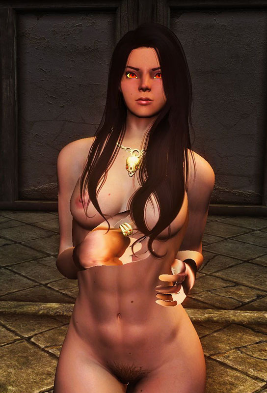
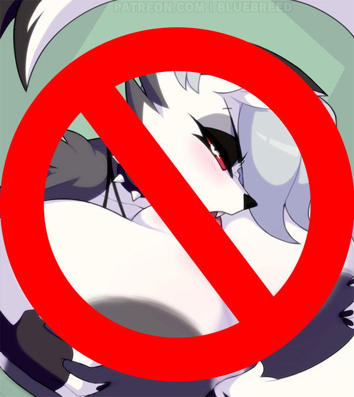

# Muscle definition

After many months of frustrating work trying to do this in [Sandow Plus Plus][], it seems I finally managed to make vary muscle definition without varying weight.

This approach doesn't use NiOverride for texture overriding, since it's quite fickle in Skyrim SE and it does whatever the hell it feels like. \
I suspect this is a problem with the new optimizations to nif files that were made for SE, but I have no way to confirm this.

## Some context on what failed
This will totally matters to you if you are trying to develop a mod that changes normal maps using NiOverride fo SSE.

You may inocently think that changing normal maps is as easy and simple as adding a normal map override to the body and be done (just as I thought when I was young and inocent), but no.\
For some reason, **doing so applies the same normal texture on the hands as well**, and if you want to unreliably deal with that you need to do all kind of hacks that randomly work whenever they feel like.

Go see my own [Sandow Plus Plus source code][SppRippedBranch] to marvel at what a fucking mess is trying to (unsuccessfully) do that.

Hell, that seemingly inocent idea so sapped my will to work with NiOverride (and my sanity) that SPP is mostly abandonware nowadays.

<figure>

<figcaption>I literally spent hundreds of hours and moths on not solving this issue, thank you very much for asking.</figcaption>
</figure>

My primary method to deal with those pizza hands was to just add a hands overlay on the first overlay layer (`"Hands [Ovl0]"`). I deemed that a reasonable solution because what kind of freak uses hand overlays, anyway? :v

It seemed to worked alright, but **if wanted that method to be compatible with other mods** that add their own overrides, like Wet Function Redux, I needed to transfer changes made by them.\
And that was the beginning of the end.

For some reason, Skyrim (or NiOverride?) sometimes lost track of the skin color and I got miscolored hands, I added too much conditional code that tried to solve that, but the hand color problem sometimes triggered at random times (just to never go away on that playthrough) even if everything was supposed to be working as expected; variables had correct values, they were being correctly applied...\
That's were I just gave up.

You can see that whole ordeal [here][SppTextureManager].

## The new method that actually works
It uses `BaseActor.SetSkin(some_naked_armor)` to put bodies with different muscle definitions on actors.

Quick technical background: in Skyrim, naked bodies are actually armors (yeah... like in Daedric or Iron Armor). When you are setting a skin (a naked body), you are setting an armor as the default body for an actor.

Armors use **Armor Addons** to select which race will use what appearance.\
For example, thanks to Armor Addons you could have a cowl (like the Shrouded one) that will use some model on humanoids and that will use some other completely different model on Argonians or Khajiit... hell you could even have dogs using that same cowl if you created a new Armor Addon for dogs.

Knowing this, we can deduce some things about the new method for making actors ripped:

* Doesn't need NiOverride skin/node overrides at all.
* It's 100% compatible with any mod that applies its own overrides.
* Needs armor records inside an `esp` file.

In fact, the `esp` file needs a new armor record for each muscle definition type AND muscle definition level. This mod uses 3 types (plain, athletic and fat) with 6 different levels. That means, 18 different armors.

There are also 3 special armors that automatically select the aproppiate muscle definition level based on weight using Skin Texture Swap Lists (the method I used for [Ripped Bodies][SPP Ripped Bodies]).\
Total armors used: 21.

<figure>

<figcaption>Armors ending in 00 automatically change their muscle definition using a Swap List on their Armor Addons. Otherwise, they explicitly set that muscle definition level.</figcaption>
</figure>

There are 3 big racial groups in vanilla races: Humanoids (Men and Mer), Khajiit and Argonians.\
Each one of those need:

* One Armor Addon for the torso.\
 Armor Addons per racial group: 21.
* Each Armor Addon needs a Texture Set for its muscle definition level. Multiply by 2 because there are only 2 genders.\
Texture Sets per race: 18&times;2=36.
* The 3 special armor addons that automatically swap textures based on weight need 1 formlist per gender.\
Formlists for the special armor for just one race: 3&times;1&times;2=18.

Want to add a completely new racial group, like furries or something? Add all those records above to the esp and change many, many things in [Max Sick Gains.exe].

<figure>

<figcaption>Now you know why I'm not enabling muscle definition for some types of non vanilla races.</figcaption>
</figure>

Non vanilla races that kinda fit in the vanilla racial groups may need a minor patch for their respective Armor Addons. It should hopefully be just a matter of adding their race to them.

# Method overview

Here's the overview of the method for changing normal maps on actors:

## Non coding steps

1. Create zeroed-slider bodies in Bodyslide. This will prevent bodies from varying by weight.
1. For each muscle definition level, create a new naked armor with its respective armor addons in the CK.
1. Create your wanted muscle definition texture sets in the CK.
1. Create a formlist containing those texture sets.
1. Assign this formlist to the new armor addon.

This will create a body that has many different muscle definition levels according to weight.

This is mostly the way [SPP Ripped Bodies][] work, but here we are making a new naked body with its own list for each type of muscle definition we want (only fat textures, only fit textures...).

## Papyrus steps

1. Set `Actor` body shape using `NiOverride.SetMorphValue`. This will set the overall shape of the actor.
1. Assign your desired muscle definition by setting the actor skin to the new armor you created: `(npc.GetBaseObject() as ActorBase).SetSkin(custom_naked_armor)`.

All previous steps decouple weight from appearance and body shape.

If you want to:

- Vary the appearance of the actor, as if changing weight: `NiOverride.SetMorphValue`.
- Vary muscle definition using a la [Ripped Bodies][SPP Ripped Bodies]: `SetNPCWeight(new_weight)`.
- Switch to other kind of muscle definition: `BaseActor.SetSkin(other_naked_armor)`

# Wrapping up

That's all there is to this mod.

Of course, the implementation of these ideas is an entirely different matter. \
There are many interpolations to make transitions smooth, managing variables, etc, but the general idea behind this mod is what you have seen in this page.

[Sandow Plus Plus]: https://github.com/CarlosLeyvaAyala/Sandow-Plus-Plus

[SPP Ripped Bodies]: https://www.nexusmods.com/skyrimspecialedition/mods/34632

[SppRippedBranch]: https://github.com/CarlosLeyvaAyala/Sandow-Plus-Plus/tree/more-compatible-ripped

[SppTextureManager]: https://github.com/CarlosLeyvaAyala/Sandow-Plus-Plus/blob/more-compatible-ripped/scripts/source/DM_SandowPP_TextureMngr.psc

[Max Sick Gains.exe]: https://github.com/CarlosLeyvaAyala/Max-Sick-Gains-exe
